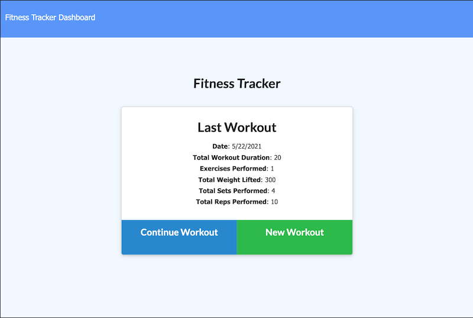
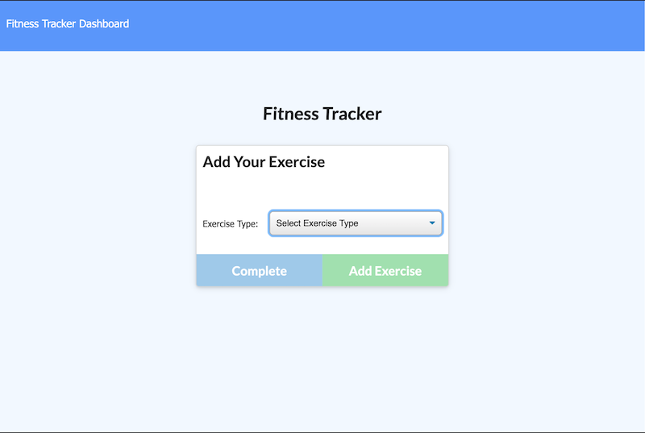
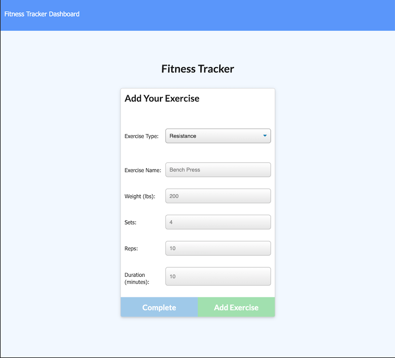
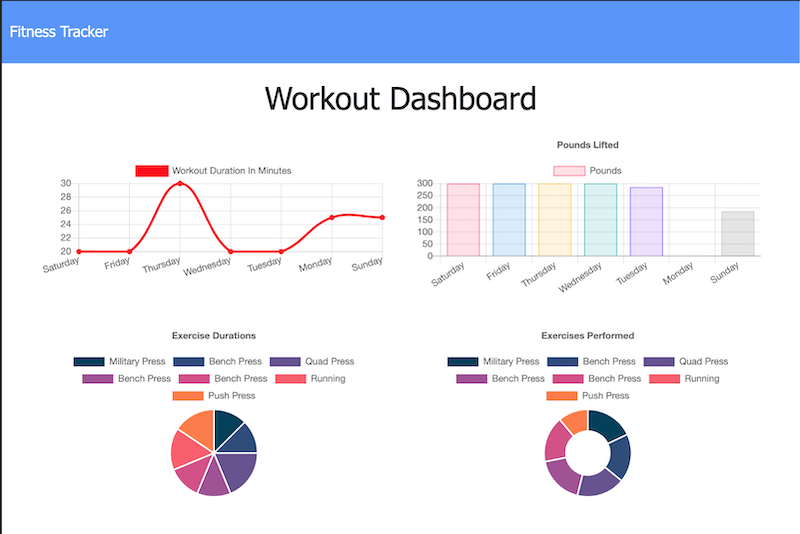

# workout-tracker

## Description
    A workout tracker to view, create, and track daily workouts.  
    The front end code was provided, this project involves using  
    a Mongo database, a Mongoose Schema, and Express for routing.

## Screenshots
   
   
   
   

## Links
   [Deployed Site](https://workout-eyrie-46993.herokuapp.com/)
   [Repo Link](https://github.com/takolad/workout-tracker)

## License
   
   [MIT License](https://opensource.org/licenses/MIT)